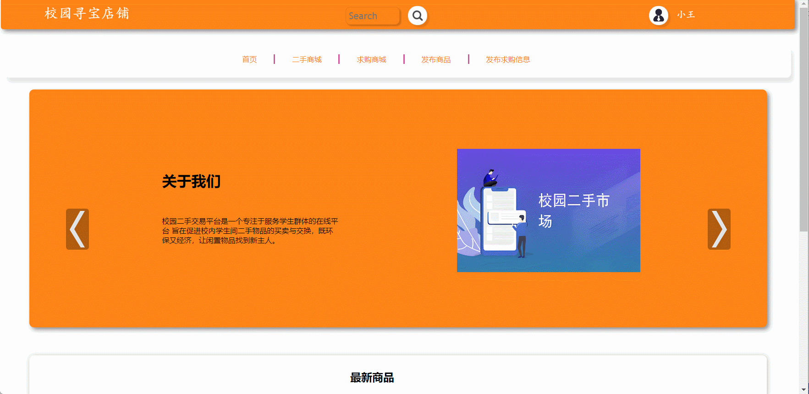

#  second-hand-store🎂

基于SpringBoot+Thymeleaf的校园二手平台

## 介绍🌞

> 该平台旨在提高学生间二手物品交易的效率和便捷性，促进校园资源共享，改善学生生活质量。同时涵盖了商品展示、留言、收藏等功能模块。前端使用HTML和Thymeleaf模板引擎进行页面渲染，后端基于Spring Boot框架搭建RESTFUL API接口，实现了用户注册登录、商品发布管理、分类筛选等核心功能（本系统只有一种角色）。

## 项目演示🌞



## 安装教程🌞

```
1. 运行环境准备mysql8 + java8

2. 配置maven路径，加载依赖

3. 运行sql文件，确保application.yml或config.properties的数据库名称和账号密码是数据库所在主机的账号密码
```


## 使用说明🌞

```
1. 登入

      账号：1 密码：123456
  
2. 运行流程

SpringBoot+Vue项目的部署详情可以查看这篇CSDN博客：http://t.csdnimg.cn/kpuxS

前后端不分离项目的部署流程可以查看这篇CSDN博客：http://t.csdnimg.cn/CslA5
```


## CSDN项目合集🌞

点击前往：http://t.csdnimg.cn/Q4u84


## 联系我🌞

**有偿获取完整源码或调试代码**

🐧：1902317191

微信：


